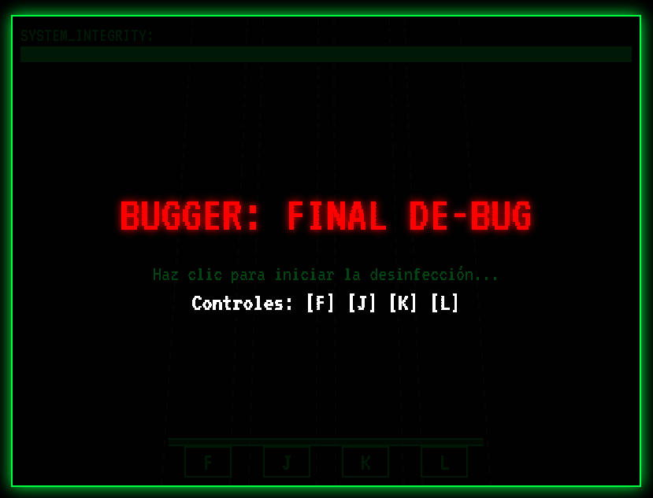
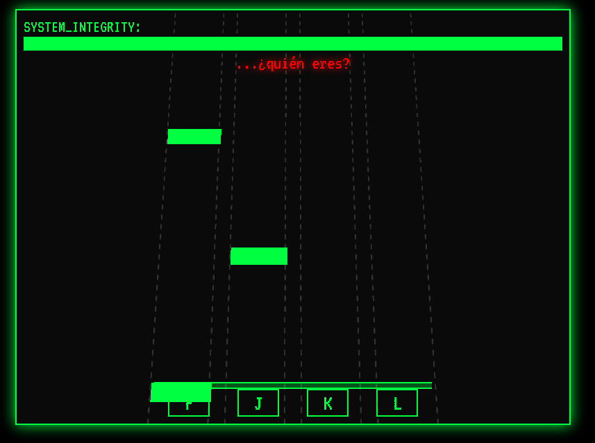
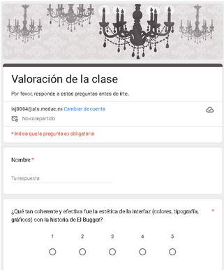
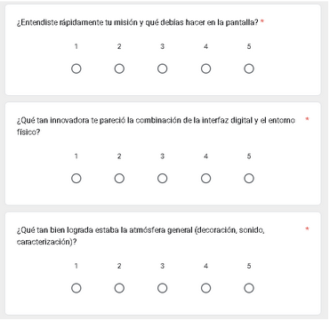
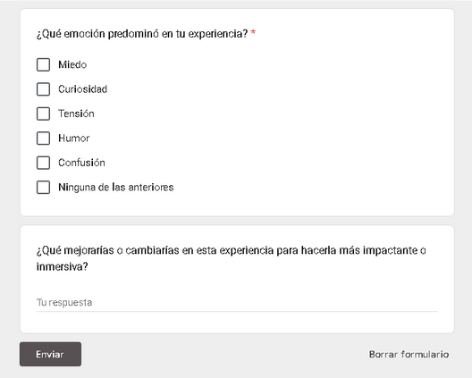

# BUGGER: FINAL DE-BUG

## 🖼️ Vistazo Rápido (Screenshots)

Aquí puedes ver algunas capturas de pantalla de la interfaz, la acción del juego y el formulario post-partida.

### 1. Interfaz Principal


### 2. JUEGO


### 3. FINAL


### 4. Introducción al Formulario


### 5. Contenido del Formulario


###6. Final del Formulario


---

## 🛑 ADVERTENCIA DE CONTENIDO (Content Warning)

Este proyecto contiene elementos de **horror**, efectos de **glitch**, y un **screamer** (salto de susto) al fallar. Se recomienda discreción.

---

## 💻 ¿Qué hace?

**BUGGER: FINAL DE-BUG** es una experiencia interactiva de ritmo y terror psicológico implementada en un solo archivo HTML. El juego simula un intento de desinfectar o "depurar" un sistema que ha sido infectado por una entidad maliciosa conocida como "El Bugger".

El objetivo del jugador es **mantener la INTEGRIDAD del sistema** a lo largo de una secuencia de tiempo fija, realizando acciones de ritmo y ciberataque bajo presión.

### Características Principales:

* **Mecánica de Ritmo (Rhythm Game):** El jugador debe pulsar las teclas **[F] [J] [K] [L]** a tiempo con los "paquetes de datos" que caen por las cuatro líneas de código.
* **Eventos de Inyección (Código):** Interrupciones donde el jugador debe teclear una secuencia específica de teclas en un tiempo limitado.
* **Interferencias (Popups):** Ventanas emergentes que penalizan al jugador si intenta pulsar las teclas de ritmo. Deben cerrarse usando **[ENTER]**.
* **Finales Condicionales:** El juego tiene una duración predeterminada. Si la integridad llega a cero, se activa la secuencia de **Game Over** (Screamer). Si el jugador sobrevive, el sistema es "limpiado".
* **Redirección Post-Juego:** Una vez que el juego termina (ganado o perdido), el usuario es redirigido a un formulario externo para recolección de datos o feedback.

---

## 🛠️ Tecnologías y Recursos Utilizados

Este proyecto es una aplicación **Client-Side (Lado del Cliente)** que funciona completamente en el navegador y utiliza únicamente tecnología web estándar.

### Lenguajes y Estándares
* **HTML5:** Estructura base del juego.
* **CSS3:** Estilización completa del juego (diseño estilo terminal retro/hacker con la fuente `VT323`).
* **JavaScript (ES6):** Toda la lógica del juego, el bucle principal (`gameLoop`), la gestión del estado, la lectura del *beatmap* y la interacción del usuario.

### Recursos Externos Requeridos
Para que el juego se ejecute correctamente, deben existir los siguientes archivos en el mismo directorio que el archivo HTML:

| Archivo | Tipo | Función |
| :--- | :--- | :--- |
| `boss.mp3` | Audio | Música de fondo principal (Loop). |
| `beep.mp3` | Audio | Efecto de sonido de acierto o error leve. |
| `screamer.mp3` | Audio | Efecto de sonido del Game Over (Screamer). |
| `scary_face.jpg` | Imagen | Imagen que se muestra en la pantalla de Game Over. |
| `VT323` | Fuente | Fuente monospace estilo consola (importada desde Google Fonts). |

---

## 🚀 Instalación y Uso

1.  **Clonar el Repositorio:**
    ```bash
    git clone [https://github.com/Ivannovichh/Debugger.git](https://github.com/Ivannovichh/Debugger.git)
    ```
2.  **Preparar Recursos:**
    Asegúrate de colocar los archivos de audio e imagen listados en la sección anterior dentro de la carpeta clonada.
3.  **Ejecutar:**
    Abre el archivo `index.html` directamente en cualquier navegador moderno.

---
